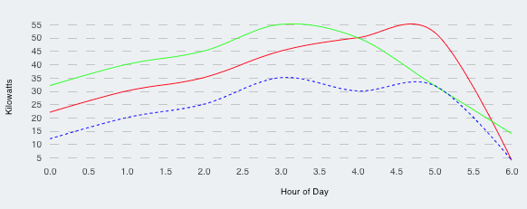

# Charts

This is a quick guide for Developers on how to implement Anexinet Charts

1. [ Bar Chart ](#barChart)
1. [ Pie Chart ](#pieChart)
1. [ Donut Chart ](#donutChart)
1. [ Stacked Barchart](#stackedBarChart)
1. [ Stacked Grouped Barchart](#stackedGroupBarChart)
1. [ Lines Chart](#stackedBarChart)
1. [ Bar with Line Chart](#barWithLineChart)

<a name="barChart"></a>

## Bar Chart

<hr/>
<br/>

### Basic Usage

Import BarChart from Charts

```
    import { BarChart } from '../[path to charts]/Charts';
```

Use as a component

```
    <BarChart data={barChartData} xAxisTitle="Months" yAxisTitle="Solar Production" />
```

<br/>


### Properties

| Property Name        | Type     | Required | Default Value | Description                                    |
| -------------------- | :------- | :------: | :-----------: | :--------------------------------------------- |
| data                 | Object[] |   Yes    |      N/A      | Data to be rendered as chart                   |
| height               | Number   |    No    |      300      | Width of the chart.                            |
| width                | Number   |    No    |      600      | Width of the chart.                            |
| xAxisTitle           | String   |    No    |      ''       | X Axis Title                                   |
| yAxisTitle           | String   |    No    |      ''       | Y Axis Title                                   |
| barWidth             | Number   |    No    |      10       | Bar width                                      |
| chartMarginTop       | Number   |    No    |      50       | Chart Margin top within the Chart Component    |
| chartMarginBottom    | Number   |    No    |      100      | Chart Margin bottom within the Chart Component |
| chartMarginLeft      | Number   |    No    |      60       | Chart Margin left within the Chart Component   |
| chartMarginRight     | Number   |    No    |      30       | Chart Margin right within the Chart Component  |
| xAxisTitleMarginTop  | Number   |    No    |       0       | X Axis title margin top                        |
| xAxisLabelRotate     | Number   |    No    |       0       | x Axis Band labels rotate degrees              |
| xAxisLabelMarginLeft | Number   |    No    |       0       | x Axis Band labels margin left                 |
| xAxisLabelMarginTop  | Number   |    No    |       0       | x Axis Band labels margin top                  |
| hideLegends          | Number   |    No    |     false     | Hide bottom legends flag                       |

<br/>

### Data

Data is composed by an array of objects with names, which will represent the X axis and value that represents the Y axis value

Data sample

     [
      { name: 'Jan', value: 35 },
      { name: 'Feb', value: 18 },
      { name: 'Mar', value: 58 },
      ...
    ];

<a name="pieChart"></a>

## Pie Chart

<hr/>
<br/>

### Basic Usage

Import PieChart from Charts

```
    import { PieChart } from '../[path to charts]/Charts';
```

Use as a component

```
    <PieChart data={pieChartData} displayLegends />
```

<br/>


### Properties

| Property Name  | Type     | Required | Default Value | Description                  |
| -------------- | :------- | :------: | :-----------: | :--------------------------- |
| data           | Object[] |   Yes    |      N/A      | Data to be rendered as chart |
| height         | Number   |    No    |      350      | Height of the chart.         |
| width          | Number   |    No    |      300      | Width of the chart.          |
| margin         | Number   |    No    |      50       | X Axis Title                 |
| displayLegends | Bool     |    No    |     False     | Y Axis Title                 |

<br/>

### Data

Data is composed by an array of objects which contains

- _name_: Represent each slice.
- _value_: Represents size of each slice.
- _displayValue_: Value to be displayed inside a slice.
- _color_: Fill color of the slice.

Data sample

    [
      { name: 'Solar', displayValue: 'A', value: 300, color: '#4192b8' },
      { name: 'ESS', displayValue: 'B', value: 200, color: '#db6400' },
      { name: 'Engines', displayValue: 'C', value: 80, color: '#f2d974' },
      { name: 'Utility', displayValue: 'D', value: 400, color: '#61b15a' },
    ];

<a name="donutChart"></a>

## Donut Chart

<hr/>
<br/>

### Basic Usage

Import PieChart from Charts

```
    import { PieChart } from '../[path to charts]/Charts';
```

Use as a component

```
    <DonutChart data={donutChartData} displayLegends />
```

<br/>


### Properties

| Property Name  | Type     | Required | Default Value | Description                                                                    |
| -------------- | :------- | :------: | :-----------: | :----------------------------------------------------------------------------- |
| data           | Object[] |   Yes    |      N/A      | Data to be rendered as chart                                                   |
| height         | Number   |    No    |      350      | Height of the chart.                                                           |
| width          | Number   |    No    |      300      | Width of the chart.                                                            |
| margin         | Number   |    No    |      50       | X Axis Title                                                                   |
| displayLegends | Bool     |    No    |     False     | Y Axis Title                                                                   |
| radius         | Number   |    No    |      50       | Inner radius size of the donut                                                 |
| legendGroup    | Number   |    No    |       3       | Grouping number for label on bottom                                            |
| donutWidth     | Number   |    No    |      300      | Width of the Donut                                                             |
| barColors      | Object[] |   Yes    |      N/A      | Array of objects indicating color for each name, see Bar Colors example bellow |

<br/>

### Data

Data is composed by an array of objects which contains

- _name_: Represent each slice.
- _value_: Represents size of each slice.
- _displayValue_: Value to be displayed inside a slice.

Data sample

    [
      { name: 'Solar', displayValue: 'A', value: 300, color: '#4192b8' },
      { name: 'ESS', displayValue: 'B', value: 200, color: '#db6400' },
      { name: 'Engines', displayValue: 'C', value: 80, color: '#f2d974' },
      { name: 'Utility', displayValue: 'D', value: 400, color: '#61b15a' },
    ];

Bar colors

    const barColors = [
      { name: 'EV Charging', color: Colors.pacificBlue },
      { name: 'Facility Use', color: Colors.sanJuan },
      { name: 'R.Engines', color: Colors.olivine },
      { name: 'Solar', color: Colors.black },
      { name: 'Microturbine', color: Colors.red },
    ];


<a name="stackedBarChart"></a>

## Stacked Bar Chart

// TODO

<a name="stackedGroupBarChart"></a>

## Stacked Grouped Bar Chart

<hr/>
<br/>

### Basic Usage

Import PieChart from Charts

```
    import { StackedBarChart } from '../[path to charts]/Charts';
```

Use as a component

```
    <StackedBarChart data={data} xAxisTitle="Months" yAxisTitle="Energy Use (kW)" />
```

<br/>


### Properties

| Property Name        | Type     | Required | Default Value | Description                                                                    |
| -------------------- | :------- | :------: | :-----------: | :----------------------------------------------------------------------------- |
| data                 | Object[] |   Yes    |      N/A      | Data to be rendered as chart                                                   |
| height               | Number   |    No    |      300      | Width of the chart.                                                            |
| width                | Number   |    No    |      600      | Width of the chart.                                                            |
| xAxisTitle           | String   |    No    |      ''       | X Axis Title                                                                   |
| yAxisTitle           | String   |    No    |      ''       | Y Axis Title                                                                   |
| barWidth             | Number   |    No    |      10       | Bar width                                                                      |
| chartMarginTop       | Number   |    No    |      50       | Chart Margin top within the Chart Component                                    |
| chartMarginBottom    | Number   |    No    |      100      | Chart Margin bottom within the Chart Component                                 |
| chartMarginLeft      | Number   |    No    |      60       | Chart Margin left within the Chart Component                                   |
| chartMarginRight     | Number   |    No    |      30       | Chart Margin right within the Chart Component                                  |
| xAxisTitleMarginTop  | Number   |    No    |       0       | X Axis title margin top                                                        |
| xAxisLabelRotate     | Number   |    No    |       0       | x Axis Band labels rotate degrees                                              |
| xAxisLabelMarginLeft | Number   |    No    |       0       | x Axis Band labels margin left                                                 |
| xAxisLabelMarginTop  | Number   |    No    |       0       | x Axis Band labels margin top                                                  |
| hideLegends          | Number   |    No    |     false     | Hide bottom legends flag                                                       |
| barColors            | Object[] |   Yes    |      N/A      | Array of objects indicating color for each name, see Bar Colors example bellow |

<br/>

### Data

Data is composed by an array of objects which contains

- _group_: Represents a group slice. Text to display as X Axis.
- _values_: Array of objects containing stacked values.
  - _name_: Value name. Text to display as legend.
  - _value_: Number that represents the bar
  - _color_: Color of the bar

\*\* Note: if an element within a group is omitted, the chart will default an element with a value of 0.

Data sample

    [
      {
        group: 'Jan',
        values: [
          [{ name: 'EV Charging', value: 10, color: '#0B94BC' }, { name: 'Facility Use', value: 5, color: '#285469' }],
          [
            { name: 'R.Engines', value: 44, color: '#FAEAA3' },
            { name: 'Solar', value: 15, color: '#C13017' },
            { name: 'Microturbine', value: 15, color: '#EBCB39' },
          ],
        ],
      },
      {
        group: 'Feb',
        values: [
          [{ name: 'EV Charging', value: 10, color: '#0B94BC' }, { name: 'Facility Use', value: 10, color: '#285469' }],
          [
            { name: 'R.Engines', value: 23, color: '#FAEAA3' },
            { name: 'Solar', value: 15, color: '#C13017' },
            { name: 'Microturbine', value: 15, color: '#EBCB39' },
          ],
        ],
      },
      ...
    ];

Bar colors

    const barColors = [
      { name: 'EV Charging', color: Colors.pacificBlue },
      { name: 'Facility Use', color: Colors.sanJuan },
      { name: 'R.Engines', color: Colors.olivine },
      { name: 'Solar', color: Colors.black },
      { name: 'Microturbine', color: Colors.red },
    ];

<a name="stackedBarChart"></a>

## Lines Chart

<hr/>
<br/>

### Basic Usage

Import LinesChart from Charts

```
    import { LinesChart } from '../[path to charts]/Charts';
```

Use as a component

```
    <LinesChart data={lineChartData} groupLines={groupLines} xAxisTitle="Hour of Day" yAxisTitle="Kilowatts" />
```

<br/>



### Properties

| Property Name        | Type     | Required | Default Value | Description                                                  |
| -------------------- | :------- | :------: | :-----------: | :----------------------------------------------------------- |
| data                 | Object[] |   Yes    |      N/A      | Data to be rendered as chart                                 |
| height               | Number   |    No    |      300      | Width of the chart.                                          |
| width                | Number   |    No    |      600      | Width of the chart.                                          |
| xAxisTitle           | String   |    No    |      ''       | X Axis Title                                                 |
| yAxisTitle           | String   |    No    |      ''       | Y Axis Title                                                 |
| barWidth             | Number   |    No    |      10       | Bar width                                                    |
| minValue             | Number   |    No    |       0       | Min Value                                                    |
| maxValue             | Number   |    No    |      N/A      | Max Value; If not provided will calculate the max value      |
| chartMarginTop       | Number   |    No    |      50       | Chart Margin top within the Chart Component                  |
| chartMarginBottom    | Number   |    No    |      100      | Chart Margin bottom within the Chart Component               |
| chartMarginLeft      | Number   |    No    |      60       | Chart Margin left within the Chart Component                 |
| chartMarginRight     | Number   |    No    |      30       | Chart Margin right within the Chart Component                |
| groupLines           | Object[] |    No    |      []       | Array of object indicating line specs, see groupLines bellow |
| xAxisTitleMarginTop  | Number   |    No    |       0       | X Axis title margin top                                      |
| xAxisLabelRotate     | Number   |    No    |       0       | x Axis Band labels rotate degrees                            |
| xAxisLabelMarginLeft | Number   |    No    |       0       | x Axis Band labels margin left                               |
| xAxisLabelMarginTop  | Number   |    No    |       0       | x Axis Band labels margin top                                |
| hideLegends          | Number   |    No    |     false     | Hide bottom legends flag                                     |
| xAxisScaleType       | String   |    No    |  scaleLinear  | Scale type for X Axis                                        |
| legendGroup          | Number   |    No    |       3       | Grouping number for label on bottom                          |

<br/>

### Data

Data is composed by an array of objects with groups, which represents the line, with names, which will represent the X axis and value which represents the Y axis value of the line.

Data sample

    const lineChartData = [
      { group: 'Solar', name: 0, value: 22 },
      { group: 'Solar', name: 1, value: 30 },
      { group: 'Solar', name: 2, value: 35 },
      { group: 'Solar', name: 3, value: 45 },
      { group: 'Solar', name: 4, value: 50 },
      { group: 'Solar', name: 5, value: 52 },
      { group: 'Solar', name: 6, value: 4 },
      { group: 'Weekday', name: 0, value: 32 },
      { group: 'Weekday', name: 1, value: 40 },
      { group: 'Weekday', name: 2, value: 45 },
      { group: 'Weekday', name: 3, value: 55 },
      { group: 'Weekday', name: 4, value: 50 },
      { group: 'Weekday', name: 5, value: 32 },
      { group: 'Weekday', name: 6, value: 14 },
      { group: 'Weekend', name: 0, value: 12 },
      { group: 'Weekend', name: 1, value: 20 },
      { group: 'Weekend', name: 2, value: 25 },
      { group: 'Weekend', name: 3, value: 35 },
      { group: 'Weekend', name: 4, value: 30 },
      { group: 'Weekend', name: 5, value: 32 },
      { group: 'Weekend', name: 6, value: 4 },
    ];

You can specify line color and if the line should be dashed by setting the groupLines parameter and sending an array indicating the group name, the color of the group line and if the line is dashed or not

    const groupLines = [
      { group: 'Solar', color: '#FF0000' },
      { group: 'Weekday', color: '#00FF00' },
      { group: 'Weekend', color: '#0000FF', isDashed: true },
    ];

<a name="barWithLineChart"></a>

## Bar with Line Chart

### Properties

| Property Name     | Type     | Required | Default Value | Description                                             |
| ----------------- | :------- | :------: | :-----------: | :------------------------------------------------------ |
| data              | Object[] |   Yes    |      N/A      | Data to be rendered as chart                            |
| height            | Number   |    No    |      300      | Width of the chart.                                     |
| width             | Number   |    No    |      600      | Width of the chart.                                     |
| xAxisTitle        | String   |    No    |      ''       | X Axis Title                                            |
| yAxisTitle        | String   |    No    |      ''       | Y Axis Title                                            |
| barWidth          | Number   |    No    |      10       | Bar width                                               |
| minValue          | Number   |    No    |       0       | Min Value                                               |
| maxValue          | Number   |    No    |      N/A      | Max Value; If not provided will calculate the max value |
| chartMarginTop    | Number   |    No    |      50       | Chart Margin top within the Chart Component             |
| chartMarginBottom | Number   |    No    |      100      | Chart Margin bottom within the Chart Component          |
| chartMarginLeft   | Number   |    No    |      60       | Chart Margin left within the Chart Component            |
| chartMarginRight  | Number   |    No    |      30       | Chart Margin right within the Chart Component           |
| barColor          | String   |    No    |    #FF0000    | Bar Color                                               |
| lineColor         | String   |    No    |    #00FF00    | Line Color                                              |

<br/>

### Data

Data is composed by an array of objects with names, which will represent the X axis and bar value that represents the Y axis value of the bars, and lineValue which represents the Y axis value of the line.

Data sample

    const barLineChartData = [
      { name: 'Jan', barValue: 10, lineValue: 35 },
      { name: 'Feb', barValue: 25, lineValue: 18 },
      { name: 'Mar', barValue: 30, lineValue: 58 },
      { name: 'Apr', barValue: 35, lineValue: 65 },
      { name: 'May', barValue: 55, lineValue: 9 },
      { name: 'Jun', barValue: 29, lineValue: 35 },
      { name: 'Jul', barValue: 10, lineValue: 72 },
      { name: 'Aug', barValue: 30, lineValue: 41 },
      { name: 'Sep', barValue: 50, lineValue: 21 },
      { name: 'Oct', barValue: 80, lineValue: 30 },
      { name: 'Nov', barValue: 10, lineValue: 21 },
      { name: 'Dec', barValue: 20, lineValue: 50 },
    ];
